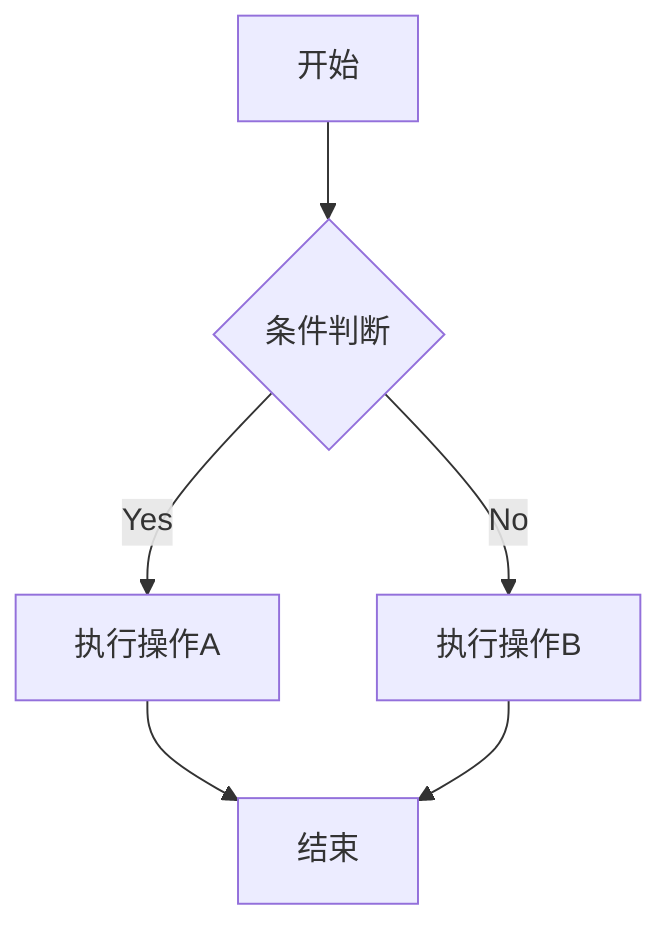
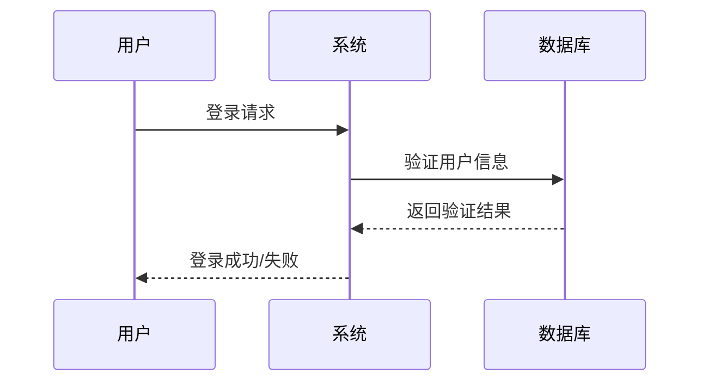

折行: 单行后尾加两个空格  
折行: 单行后尾\
折行: 单行后尾<br />
折行: 单行后尾

这是**粗体文字**使用星号  
这是**粗体文字**使用下划线  
这是 **粗体文字** 使用下划线

_斜体文本_  
_斜体文本_  
**粗体文本**  
**粗体文本**  
**_粗斜体文本_**  
**_粗斜体文本_**

这段文字包含**粗体**、*斜体*和**_粗斜体_**的组合效果。

分割线

---

---

---

---

---

~~BAIDU.COM~~

创建脚注格式类似这样 [^RUNOOB]。
[^RUNOOB]: 菜鸟教程 -- 学的不仅是技术，更是梦想！！！

行内代码标记
`asdf`
要显示反引号，使用 `` `code` `` 这样的格式

这是==高亮文本=\
这是<mark>高亮文本</mark>

1. 主要任务
   - 子任务 A
   - 子任务 B
     1. 详细步骤 1
     2. 详细步骤 2
   - 子任务 C
2. 次要任务

- [ ] 未完成的任务
- [x] 已完成的任务
- [ ] 另一个未完成的任务

- 这是一个很长的列表项，\
  需要换行显示，注意第二行需要与第一行对齐
- 另一个列表项

> 引用块  
> 最外层
>
> > 第一层嵌套
> >
> > > 第二层嵌套

正常文本段落

    这是缩进式代码块
    每行前面有四个空格
    保持代码的原始格式

继续正常文本

```
代码块语法
常用语言标识符列表：

javascript / js - JavaScript
python / py - Python
html - HTML
css - CSS
sql - SQL
json - JSON
xml - XML
yaml / yml - YAML
bash / shell - Shell脚本
java - Java
cpp / c++ - C++
csharp / c# - C#
php - PHP
ruby / rb - Ruby
go - Go语言
rust - Rust
typescript / ts - TypeScript
```

代码块的高级特性
行号显示

```javascript {.line-numbers}
function fibonacci(n) {
  if (n <= 1) return n;
  return fibonacci(n - 1) + fibonacci(n - 2);
}

console.log(fibonacci(10));
```

Diff 语法：

```diff
function calculateTotal(items) {
-   let total = 0;
+   let total = 0.0;

    for (let item of items) {
-       total += item.price;
+       total += parseFloat(item.price);
    }

+   // 保留两位小数
+   total = Math.round(total * 100) / 100;
    return total;
}
```

语言特定的差异对比：

```javascript
// 之前的代码
const oldFunction = () => {
  var x = 10; // &#x274c; 使用 var
  console.log('Value: ' + x); // &#x274c; 字符串拼接
};

// 改进后的代码
const newFunction = () => {
  const x = 10; // &#x2705; 使用 const
  console.log(`Value: ${x}`); // &#x2705; 模板字符串
};
```

这是一个链接 [菜鸟教程](https://www.runoob.com)  
<https://www.runoob.com>

这个链接用 1 作为网址变量 [Google][1]  
这个链接用 runoob 作为网址变量 [Runoob][runoob]  
然后在文档的结尾为变量赋值（网址）

[1]: http://www.google.com/
[runoob]: http://www.runoob.com/

## 在线教程

- [MDN Web Docs][mdn] - 权威的 Web 技术文档
- [RUNOOB][rnb] - 适合初学者的教程网站
- [freeCodeCamp][fcc] - 免费的编程学习平台

## 代码托管

- [GitHub][github] - 最受欢迎的代码托管服务
- [GitLab][gitlab] - 企业级的代码管理平台

<!-- 链接定义区域 -->

[mdn]: https://developer.mozilla.org/
[rnb]: https://www.runoob.com/
[fcc]: https://www.freecodecamp.org/
[github]: https://github.com/
[gitlab]: https://gitlab.com/

## 目录

- [第一章：介绍](#第一章介绍)
- [第二章：安装](#第二章安装)
- [第三章：使用方法](#第三章使用方法)
- [跳转到自定义位置](#custom-anchor)

# 第一章：介绍

这里是介绍内容...

# 第二章：&\*()^%$@!~安装

这里是安装说明...

# 第三章：使用方法

这里是使用说明...
锚点规则：

标题会自动生成锚点  
锚点名称通常是标题的小写形式  
空格替换为连字符  
移除特殊字符

<a id="custom-anchor"></a>

## 自定义锚点位置

高级语法  
行内数学表达式
$
\begin{Bmatrix}
   a & b \\
   c & d
\end{Bmatrix}
$  
块级数学表达式

$$
\begin{CD}
   A @>a>> B \\
@VbVV @AAcA \\
   C @= D
\end{CD}
$$

$$
    \begin{align}
    f(x) &= ax^2 + bx + c \\
    f'(x)  &= 2ax + b \\
    f''(x)  &= 2a
    \end{align}
$$

常见的 Markdown 图表工具  
Mermaid  
Mermaid 是最流行的 Markdown 图表工具之一，它允许你使用简单的文本语法生成各种图表。



时序图语法要点：

participant 定义参与者
->> 实线箭头
-->> 虚线箭头
note 添加注释


